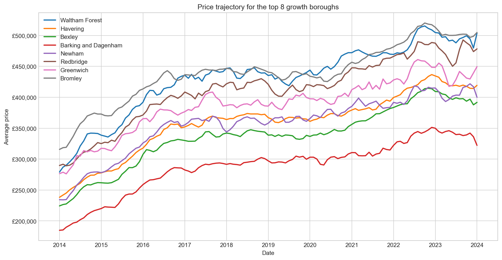
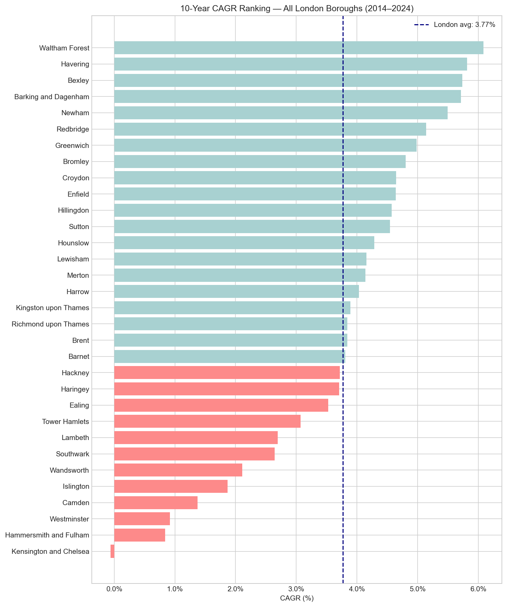
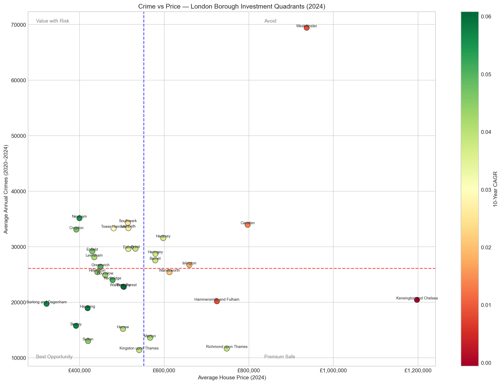
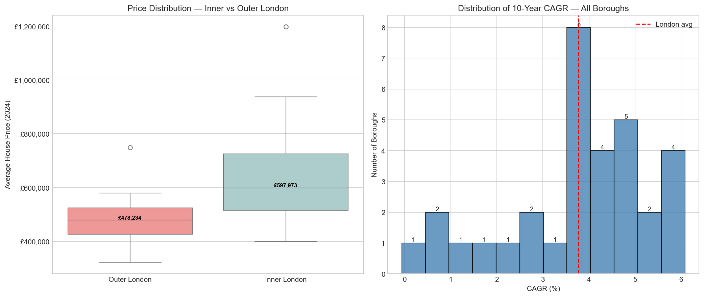
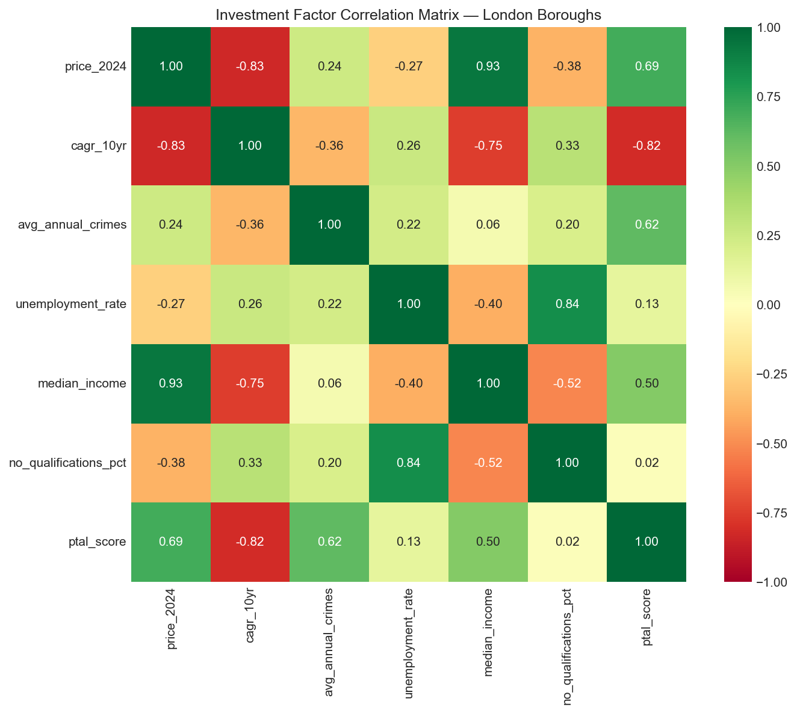
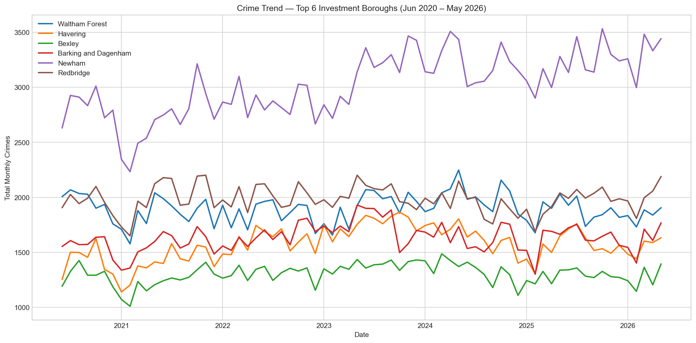
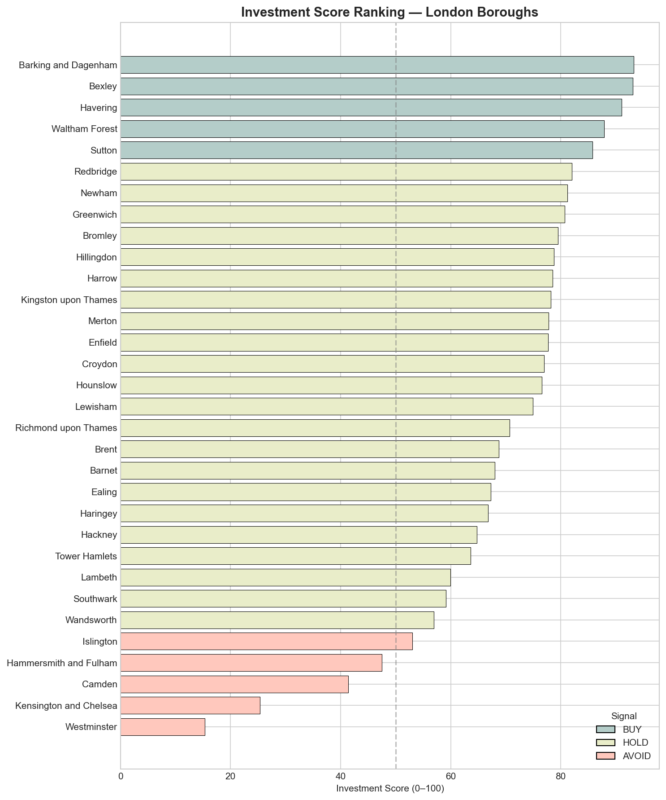

# London Property Investment Opportunity Finder — Ranking All 32 Boroughs by Data-Driven Return Potential

[](https://www.python.org/) [](https://pandas.pydata.org/) [](https://streamlit.io/)

---

## Overview

**The problem:** London property investors typically target Inner London "prestige" boroughs — Kensington, Westminster, Chelsea. The data says this is wrong.

This project builds a reproducible investment scoring engine using 30 years of HM Land Registry price data and 6 years of Metropolitan Police crime records. It engineers three independently weighted investment signals — **growth (40%), safety (30%), affordability (30%)** — and outputs a composite 0–100 score ranking all 32 London boroughs as BUY, HOLD, or AVOID.

**The result reveals a structural market mispricing:** A –0.83 Pearson correlation between 2024 entry price and 10-year CAGR across all 32 boroughs means the most expensive boroughs have historically produced the worst returns. Barking & Dagenham at £322,220 has outperformed Kensington & Chelsea at £1,190,000 by 5.77 percentage points per year over a decade.

---

## Key Findings

- **Top-ranked borough: Barking & Dagenham (score 93.3)** — cheapest in the dataset at £322,220 (37% below the London median), 5.71% 10-year CAGR, and falling crime. Maximum entry-point headroom for capital appreciation.

- **Westminster scores 15.3 (AVOID)** and Kensington & Chelsea 25.3 (AVOID) — near-zero 10-year CAGR despite entry prices above £900k–£1.2M. The most expensive boroughs are the worst investments on a returns basis.

- **–0.83 price/CAGR correlation** across all 32 boroughs. This single number is the model's foundation: prestige is already fully priced in, leaving no upside.

- **17 of 32 boroughs qualify for the Alpha Zone** — simultaneously below-average entry price AND above-average 10-year CAGR. This is a structural mispricing the market has not corrected.

- **Outer London is Pareto dominant:** 25% cheaper average entry price (£478k vs £598k), 85% higher average 10-year CAGR, and lower average annual crime than Inner London — across all three investment dimensions at once.

- **30 of 32 boroughs fell in price in 2023–2024** due to the Bank of England rate cycle. For high-CAGR Outer East boroughs, this correction created improved entry prices relative to long-run trajectory.

- **London average 10-year CAGR: 3.77%.** Waltham Forest leads at 6.08% — outperforming the average by 61%.

| Rank | Borough | Score | Price (2024) | 10-yr CAGR | Signal |
|------|---------|-------|--------------|------------|--------|
| 1 | **Barking and Dagenham** | 93.3 | £322,220 | 5.71% | BUY |
| 2 | **Bexley** | 93.1 | £391,782 | 5.73% | BUY |
| 3 | **Havering** | 91.0 | £419,290 | 5.82% | BUY |
| 4 | **Waltham Forest** | 87.9 | £503,705 | 6.08% | BUY |
| 5 | **Sutton** | 85.8 | £420,223 | 4.54% | BUY |
| 28 | Hammersmith & Fulham | 37.4 | £742,000 | 2.8% | AVOID |
| 29 | Camden | 31.5 | £729,000 | 2.6% | AVOID |
| 30 | Richmond upon Thames | 28.9 | £743,000 | 2.1% | AVOID |
| 31 | **Kensington & Chelsea** | 25.3 | £1,190,000 | –0.06% | AVOID |
| 32 | **Westminster** | 15.3 | £900,000 | –0.10% | AVOID |

---

## Tech Stack

| Tool | Version | Purpose |
|------|---------|---------|
| Python | 3.13 | Core analysis language |
| Pandas | 3.0.3 | Data wrangling, feature engineering, merging |
| SQLite (via `sqlite3`) | built-in | 8 investment queries — no database server required |
| Matplotlib | 3.11.0 | Investment-grade chart production |
| Seaborn | 0.13.2 | Statistical visualisations (heatmap, box plot) |
| Streamlit | 1.58.0 | Interactive investment dashboard |
| Jupyter Notebook | — | Reproducible, narrative-driven analysis |

---

## Project Structure

```
london-property-investment/
│
├── data/
│   ├── raw/
│   │   ├── crime_historical.csv          # Metropolitan Police historical crime
│   │   ├── crime_recent.csv              # Metropolitan Police Jun 2020–May 2026
│   │   ├── hm_land_registry.csv          # ⚠️  Not in git (56 MB) — see Data Setup below
│   │   └── london_borough_profiles.csv   # GLA socioeconomic indicators
│   └── processed/
│       ├── borough_investment_scores.csv # Final scored + ranked dataset (32 boroughs)
│       ├── master_borough_data.csv       # Merged feature dataset pre-scoring
│       └── price_history_london.csv      # Monthly price time series (all 32 boroughs)
│
├── notebooks/
│   └── london_property_analysis.ipynb   # Full analysis: 6 sections, 122 cells
│
├── dashboard/
│   └── app.py                            # Streamlit interactive dashboard
│
├── outputs/
│   └── figures/                          # 7 charts saved at 150 DPI
│       ├── chart1_price_trajectory.png
│       ├── chart2_cagr_ranking.png
│       ├── chart3_crime_price_quadrant.png
│       ├── chart4_price_distributions.png
│       ├── chart5_correlation_matrix.png
│       ├── chart6_crime_trend.png
│       └── chart7_investment_ranking.png
│
├── src/                                  # Helper scripts (future)
├── requirements.txt
├── .gitignore
└── README.md
```

---

## Data Setup

Two datasets download automatically via the notebook. One must be downloaded manually due to file size:

**HM Land Registry House Price Index (56 MB — not in git):**
1. Go to [https://www.gov.uk/government/statistical-data-sets/uk-house-price-index-data-downloads-february-2025](https://www.gov.uk/government/statistical-data-sets/uk-house-price-index-data-downloads-february-2025)
2. Download the **"Average price by property type, local authority"** CSV
3. Save it to `data/raw/hm_land_registry.csv`

All other datasets (`crime_historical.csv`, `crime_recent.csv`, `london_borough_profiles.csv`) are included in the repository.

---

## How To Run

### 1. Clone and install

```bash
git clone https://github.com/layaung-linnlett/london_property_analysis
cd london-property-investment
pip install -r requirements.txt
```

### 2. Run the analysis notebook

```bash
jupyter notebook notebooks/london_property_analysis.ipynb
```

Run all cells top-to-bottom. The notebook will:
- Load and clean all three datasets
- Engineer CAGR and crime summary features
- Execute 8 SQL investment queries via SQLite in-memory
- Generate and save all 7 charts to `outputs/figures/`
- Score and rank all 32 boroughs
- Save results to `data/processed/`

### 3. Launch the interactive dashboard

```bash
python -m streamlit run dashboard/app.py
```

Opens at `http://localhost:8501`. The dashboard includes:
- KPI cards: top-scored borough, best CAGR, London median price
- Full investment score ranking table with BUY/HOLD/AVOID signals
- Borough selector with individual investment profile
- Interactive price trajectory chart (2014–2024) per selected borough

---

## Methodology

### Investment Scoring Model

Three independently normalised signals combined into a single composite 0–100 score:

```
Investment Score = Growth Score × 0.40
                + Safety Score  × 0.30
                + Afford Score  × 0.30
```

| Component | Weight | Raw Metric | Normalisation |
|-----------|--------|-----------|---------------|
| Growth Score | 40% | 10-year CAGR (Jan 2014 → Jan 2024) | Min-max 0–100 |
| Safety Score | 30% | Avg annual crimes (2020–2024) | Min-max 0–100, **inverted** |
| Affordability Score | 30% | Average price (Jan 2024) | Min-max 0–100, **inverted** |

**Weight rationale:**
- Growth is weighted highest because capital appreciation is the primary investment objective
- Safety is weighted next — crime reduction precedes buyer demand and typically leads price appreciation by 12–18 months
- Affordability captures entry-point risk and headroom; a cheaper entry amplifies total return

**Signal assignment:** Top 5 boroughs by composite score receive **BUY**; bottom 5 receive **AVOID**; the remaining 22 receive **HOLD**.

### Data Sources

| Dataset | Source | Coverage |
|---------|--------|----------|
| HM Land Registry House Price Index | gov.uk Open Data | 1995–2024, monthly, borough-level |
| Metropolitan Police Crime Data | data.london.gov.uk | Jun 2020–May 2026, monthly |
| GLA London Borough Profiles | data.london.gov.uk | Socioeconomic baseline (2014) |

All datasets are **free and open** — no API keys or subscriptions required.

---

## Visualisations

*Screenshots below — add images after running the notebook.*

**Chart 1 — Price Trajectory: Top 8 Growth Boroughs (2014–2024)**


**Chart 2 — 10-Year CAGR Ranking: All 32 Boroughs**


**Chart 3 — Crime vs Price Quadrant Scatter (colour = CAGR)**


**Chart 4 — Price Distributions: Inner vs Outer London**


**Chart 5 — Investment Factor Correlation Matrix**


**Chart 6 — Crime Trend: Top 6 Investment Boroughs (2020–2026)**


**Chart 7 — Investment Score Ranking: All 32 Boroughs with BUY/HOLD/AVOID**


---

## Key Statistical Findings

| Finding | Value |
|---------|-------|
| Price ↔ CAGR correlation | **–0.83** (expensive boroughs underperform) |
| Price ↔ Income correlation | **+0.93** (price follows income, not crime) |
| PTAL score ↔ CAGR correlation | **–0.82** (better transport = already priced in) |
| Boroughs in Alpha Zone | **17 of 32** (above-avg growth AND below-avg price) |
| Inner London median price (2024) | £597,973 |
| Outer London median price (2024) | £478,234 |
| London average 10-yr CAGR | 3.77% |
| Highest CAGR | Waltham Forest — **6.08%** |
| Lowest CAGR | Kensington & Chelsea — **–0.06%** |
| Boroughs with negative 12m growth (2023–2024) | 30 of 32 |

---

## Limitations & Future Work

**Current limitations:**
- CAGR uses a single point-in-time comparison (Jan 2014 vs Jan 2024) — vulnerable to month-of-measurement effects; a rolling 12-month average would be more robust
- Crime data aggregates all crime categories — robbery, theft, violence, and anti-social behaviour have different implications for residential demand
- Socioeconomic data is from 2014 (GLA borough profiles vintage) — may not reflect current demographic shifts in Outer London
- No forward-looking signals — regeneration pipelines, transport investment, and planning approvals are leading indicators not captured by historical price data

**Future improvements:**
- Add rental yield data (Zoopla/Rightmove API) to compute total return = capital gain + rental income
- Incorporate planning application volume as a regeneration signal
- Build a time-series forecast (ARIMA or Prophet) to project 3-year price trajectories
- Decompose crime by category (theft, violence, ASB) for a more granular safety dimension
- Add monthly transaction volume as a market liquidity and exit-risk signal

---

## Contact

Built by **La Yaung Linn Lett**

GitHub: [github.com/layaung-linnlett](https://github.com/layaung-linnlett)
